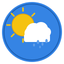

# 🌦️ Meteowatch

Aplicación de escritorio GNOME para consultar el pronóstico meteorológico usando la API de Meteored. Construida con **GTK 4 + libadwaita** y **Python 3**.

<p align="center">
  
</p>

## ✨ Funcionalidades

- **Búsqueda de ubicaciones** por nombre de ciudad
- **Pronóstico diario** de 5 días con tarjetas detalladas:
  - Temperaturas máximas y mínimas
  - Condición climática con icono (41 símbolos oficiales de Meteored)
  - Humedad, probabilidad de lluvia, viento y ráfagas
  - Amanecer, atardecer, presión, cota de nieve, índice UV y fase lunar
- **Temperatura actual** obtenida de la hora más cercana del pronóstico
- **Pronóstico por hora** de las próximas 24 horas
- **Alerta de ráfagas de viento** ≥ 50 km/h (⚠️ en la UI)
- **Zona horaria Chile** (`America/Santiago`, UTC-4/UTC-3 DST)
- **Configuración persistente** en `~/.config/meteowatch/config.json`
- **Empaquetado Flatpak** con GNOME SDK 49

## 📸 Capturas de pantalla

```
┌──────────────────────────────────────┐
│  🔄 Villarrica              📍      │
├──────────────────────────────────────┤
│          Villarrica                  │
│        🌫️   8°  Ahora               │
│                                      │
│  ┌────────────────────────────────┐  │
│  │ 🕐  Ver pronóstico 24h  →  →  │  │
│  └────────────────────────────────┘  │
│                                      │
│  ┌────────────────────────────────┐  │
│  │ 🌫️  Hoy          11°          │  │
│  │     20 de julio    2°          │  │
│  │     Niebla                     │  │
│  │ ────────────────────────────── │  │
│  │ 💧86%  🌧️0%   💨8 km/h SE   │  │
│  │ ↗️18    🌅08:02  🌇17:55      │  │
│  │ 📊1013 🏔️1600  ☀️UV 1.6     │  │
│  │ 🌙42%                          │  │
│  └────────────────────────────────┘  │
│  ┌────────────────────────────────┐  │
│  │ 🌧️  Mañana       13°         │  │
│  │     21 de julio    1°          │  │
│  │     Lluvia ligera              │  │
│  │ ────────────────────────────── │  │
│  │ 💧74%  🌧️90%  💨19 km/h E   │  │
│  │ ⚠️ ↗️36  🌅08:03  🌇17:54    │  │
│  │ ...                            │  │
│  └────────────────────────────────┘  │
└──────────────────────────────────────┘
```

## 📁 Estructura del proyecto

```
meteowatch/
├── pyproject.toml                     # Proyecto Python, dependencias, entry point
├── com.meteowatch.app.json            # Manifiesto Flatpak (GNOME SDK 49)
├── meteored_openapi.yml               # Especificación OpenAPI de Meteored
├── README.md
├── .gitignore
│
├── data/
│   ├── com.meteowatch.app.desktop     # Lanzador .desktop
│   └── com.meteowatch.app.svg         # Icono de la aplicación
│
├── flatpak-deps/                      # Wheels Python offline para build Flatpak
│
├── meteowatch/                        # Paquete principal
│   ├── __init__.py
│   ├── main.py                        # Punto de entrada
│   ├── app.py                         # Adw.Application (ciclo de vida, CSS)
│   ├── window.py                      # Ventana principal con NavigationView
│   ├── config.py                      # Configuración JSON (~/.config/meteowatch/)
│   ├── icons.py                       # Mapeo symbol → emoji (catálogo oficial 1-41)
│   ├── api/
│   │   ├── __init__.py
│   │   └── client.py                  # Cliente HTTP MeteoredClient
│   ├── models/
│   │   ├── __init__.py
│   │   ├── location.py                # Location (búsqueda)
│   │   ├── daily.py                   # DailyForecast + DayData (5 días)
│   │   └── hourly.py                  # HourlyForecast + HourData (24h)
│   └── widgets/
│       ├── __init__.py
│       ├── location_search.py         # Página de configuración y búsqueda
│       ├── daily_card.py              # Página de pronóstico diario
│       └── hourly_panel.py            # Página de detalle por hora
│
└── tests/
    ├── __init__.py
    ├── test_config.py                 # Tests de configuración (9)
    ├── test_models.py                 # Tests de modelos (12)
    └── test_icons.py                  # Tests de símbolos (7)
```

## 📋 Requisitos

| Dependencia | Versión |
|---|---|
| Python | ≥ 3.11 |
| GTK | 4.0 |
| libadwaita | 1.0 |
| PyGObject | ≥ 3.46 |
| requests | ≥ 2.31 |

## 🚀 Instalación y uso

### Desarrollo directo

```bash
# Instalar en modo editable
pip install -e .

# Ejecutar
python -m meteowatch.main
```

Al iniciar por primera vez, ingresa tu **API key de Meteored** y busca una ubicación. La configuración se guarda en `~/.config/meteowatch/config.json`.

### Flatpak

```bash
# 1. Descargar dependencias Python (si se actualizan)
python3 -m pip download --python-version 3.13 --only-binary=:all: requests setuptools -d flatpak-deps

# 2. Construir
flatpak-builder --force-clean --repo=repo build-dir com.meteowatch.app.json

# 3. Generar bundle instalable
flatpak build-bundle repo meteowatch.flatpak com.meteowatch.app --runtime-repo=https://flathub.org/repo/flathub.flatpakrepo

# 4. Instalar
flatpak install --user meteowatch.flatpak

# 5. Ejecutar
flatpak run com.meteowatch.app
```

## 🧪 Tests

```bash
python -m pytest tests/ -v
```

**28 tests unitarios** cubriendo configuración, modelos de datos y mapeo de símbolos meteorológicos.

## 🌐 API de Meteored

La aplicación consume tres endpoints. Autenticación vía header `x-api-key`.

| Endpoint | Método | Descripción |
|---|---|---|
| `/api/location/v1/search/txt/{text}` | `GET` | Búsqueda de ubicación por texto → retorna `hash` |
| `/api/forecast/v1/daily/{hash}` | `GET` | Pronóstico diario (5 días en array `days`) |
| `/api/forecast/v1/hourly/{hash}` | `GET` | Pronóstico por hora (24h en array `hours`) |

### Símbolos meteorológicos

El mapeo de iconos usa el catálogo oficial de Meteored (`/api/doc/v1/forecast/symbol`), con 41 símbolos numerados del 1 al 41:

| ID | Descripción | Emoji |
|---|---|---|
| 1 | Despejado | ☀️ |
| 4 | Parcialmente nublado | ⛅ |
| 5 | Nublado | ☁️ |
| 9 | Niebla | 🌫️ |
| 12 | Lluvia ligera | 🌦️ |
| 15 | Lluvia moderada | 🌧️ |
| 24 | Nieve | 🌨️ |
| 34 | Tormenta | ⛈️ |

## 🏗️ Arquitectura

```
main.py → app.py (Adw.Application)
            └── window.py (Adw.NavigationView)
                  ├── LocationSearchPage   (API key + búsqueda)
                  ├── DailyForecastPage    (5 tarjetas expandidas)
                  │     └── botón 24h →
                  └── HourlyForecastPage   (horas filtradas, alertas viento)
```

- **Navegación**: `Adw.NavigationView` con push/pop entre páginas
- **Hilos**: Las llamadas a la API se ejecutan en threads separados con `GLib.idle_add` para actualizar la UI
- **Rate limiting**: 1 segundo mínimo entre requests
- **Timezone**: Timestamps UTC convertidos a `America/Santiago` vía `zoneinfo`

## 📦 Flatpak

| Campo | Valor |
|---|---|
| App ID | `com.meteowatch.app` |
| Runtime | `org.gnome.Platform//49` |
| SDK | `org.gnome.Sdk//49` |
| Permisos | Wayland, X11 fallback, red, IPC |

Las dependencias Python (`requests`, `urllib3`, `certifi`, `charset-normalizer`, `idna`, `setuptools`) se incluyen como wheels offline en `flatpak-deps/` para evitar acceso a red durante el build.

## 📄 Licencia

GPL-3.0-only
