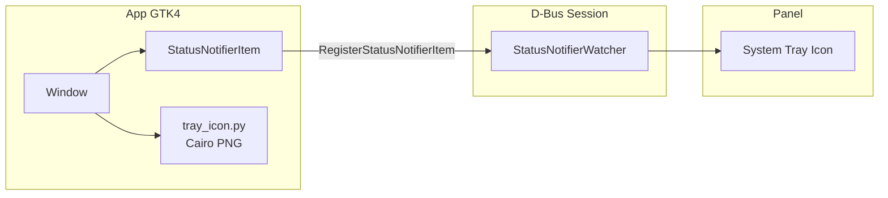

# Lecciones aprendidas: System Tray en GTK4 + Python

Documento de referencia para implementar iconos de bandeja del sistema (system tray)
en aplicaciones GTK4 + Python usando el protocolo `org.kde.StatusNotifierItem` (SNI).

**Fecha**: 2026-07-23
**Proyecto de referencia**: MeteoWatch (meteowatch)
**Escritorio de prueba**: GNOME Shell + extensión AppIndicator Support

---

## 1. Arquitectura que FUNCIONA



### Archivos necesarios (mínimo viable)

| Archivo | Rol | Dependencias |
|---|---|---|
| `status_notifier.py` | Protocolo SNI (`org.kde.StatusNotifierItem`) | Solo `Gio`, `GLib` |
| `tray_icon.py` | Generación de PNG con Cairo/Pango | `cairo`, `PangoCairo` |

**No se necesita** `dbusmenu.py` (ver sección 2).

---

## 2. Lo que NO funciona (y por qué)

### 2.1 DBusMenu (`com.canonical.dbusmenu`) — **CONGELA EL ESCRITORIO**

**Síntoma**: Al registrar un DBusMenu, GNOME Shell se congela por completo al instante.
Hay que reiniciar con el botón de power.

**Intentos fallidos**:

| Intento | Descripción | Resultado |
|---|---|---|
| 1 | `GLib.Variant("(u(ia{sv}av))", ...)` con dicts Python | ❌ Error de tipo |
| 2 | `GLib.VariantDict` para propiedades | ❌ Error de anidamiento |
| 3 | `GLib.Variant.new_tuple()` para variante externa | ❌ Congela el escritorio |
| 4 | `GLib.Variant.parse()` — delega a GLib nativo (C), elimina problemas de PyGObject | ❌ **También congela el escritorio** |
| 5 | Registrar DBusMenu **antes** que SNI (para que exista cuando el watcher lo busque) | ❌ **También congela el escritorio** |

**Conclusión definitiva**: El problema **NO está en la construcción del `GLib.Variant`**
ni en el orden de registro. Incluso usando `GLib.Variant.parse()` (que parsea el formato
de texto de GVariant en C nativo, sin intervención de PyGObject) y registrando el menú
antes que el SNI, GNOME Shell + AppIndicator se congela.

La causa raíz está en **GNOME Shell o la extensión AppIndicator**, no en nuestro código.
Posibles explicaciones:
- Bug en `gnome-shell` al procesar respuestas de `GetLayout` desde procesos Python
- La extensión AppIndicator espera un formato específico de `GVariant` que `libdbusmenu-glib`
  (C) produce pero nuestras bindings Python no replican exactamente
- Condición de carrera interna en GNOME Shell al consultar propiedades D-Bus

**Alternativas implementadas**:
- Clic medio (`SecondaryActivate`) → cerrar la app
- `Ctrl+Q` en la ventana → cerrar la app

### 2.2 SVG con `fill="currentColor"` — **TEXTO INVISIBLE**

**Síntoma**: El texto de temperatura aparece negro sobre fondo oscuro del panel.

**Causa**: 
1. Los emojis se renderizan con fuentes de color (Noto Color Emoji) que ignoran `fill`
2. `currentColor` en SVG depende del contexto de renderizado del panel, que en GNOME
   no siempre está definido correctamente

**Solución**: Usar **Cairo + PangoCairo** para generar PNG con control total de colores:
- Emoji: la fuente de emoji del sistema lo renderiza en color automáticamente
- Temperatura: blanco `#ffffff` con sombra oscura `rgba(0,0,0,0.5)` para contraste
- Fondo: transparente

### 2.3 Señal `NewIcon` — **EL PANEL NO RECARGA EL ICONO**

**Síntoma**: Al emitir `NewIcon` tras actualizar el archivo PNG, el panel sigue
mostrando el icono antiguo.

**Causa**: La implementación de AppIndicator en GNOME no procesa correctamente la
señal `NewIcon`, o cachea el icono por nombre de archivo.

**Solución**: **Alternar entre dos archivos** (`tray-icon-0.png` ↔ `tray-icon-1.png`).
Al cambiar la propiedad `IconName` a una ruta diferente, el panel **forzosamente**
recarga el icono.

```python
# En status_notifier.py
_ICON_PATHS = [
    os.path.join(TRAY_ICON_DIR, "tray-icon-0.png"),
    os.path.join(TRAY_ICON_DIR, "tray-icon-1.png"),
]

def update_icon(self, emoji, temp):
    self._icon_toggle = 1 - self._icon_toggle  # alternar 0 ↔ 1
    new_path = _ICON_PATHS[self._icon_toggle]
    self._icon_path = generate_tray_png(emoji, temp, output_path=new_path)
    self._emit_new_icon()  # por si acaso, no hace daño
```

### 2.4 Icono rectangular 48×24 — **EL PANEL LO RECORTA**

**Síntoma**: El PNG de 48×24 aparecía recortado (solo mitad superior visible,
temperatura fuera del área).

**Causa**: El slot del tray en GNOME espera un icono **cuadrado**. Si el PNG es
rectangular, el panel lo escala/recorta para ajustarlo a un área cuadrada.

**Solución**: Usar dimensiones **24×24** si el contenido cabe, o asegurarse de que
el panel de destino acepta anchos personalizados. En MeteoWatch se optó por 24×24
con layout horizontal compacto, luego se amplió a 48×24 al confirmar que el panel
de GNOME + AppIndicator sí acepta anchos variables (solo el alto es fijo).

**Regla general**: Probar con 24×24 primero. Si el panel lo permite, ampliar el ancho.

---

## 3. Generación del icono con Cairo

### 3.1 Dependencias

```python
import gi
gi.require_version("PangoCairo", "1.0")
gi.require_version("Pango", "1.0")

import cairo
from gi.repository import Pango, PangoCairo
```

`cairo` y `PangoCairo` vienen con PyGObject/GTK4 — no requieren paquetes adicionales.

### 3.2 Renderizado de texto

**Punto crítico**: Pango usa **baseline** como origen Y, no el centro ni el tope.
Para centrar verticalmente:

```python
_ink_rect, logical_rect = layout.get_pixel_extents()
text_midline = logical_rect.y + logical_rect.height // 2
draw_y = desired_center_y - text_midline
```

`logical_rect.y` es **negativo** (distancia desde baseline al tope del glifo).

### 3.3 Emojis en Cairo

Los emojis se renderizan correctamente porque Pango usa la fuente de emoji del sistema
(Noto Color Emoji). Los emojis aparecen **en color** sin necesidad de configuración adicional.
Solo el texto normal (temperatura) necesita color explícito.

### 3.4 Fuentes y tamaños recomendados

Para un icono de 48×24:

| Elemento | Fuente | Tamaño | Posición X | Color |
|---|---|---|---|---|
| Emoji | `Sans 13` | 13px | 8 | Automático (emoji font) |
| Temperatura | `Sans Bold 11` | 11px | 33 | Blanco + sombra |

---

## 4. Inicialización diferida del tray

**Problema**: Si el `StatusNotifierItem` se crea en el constructor de la ventana,
el registro D-Bus ocurre durante el arranque de GTK, lo que puede causar bloqueos.

**Solución**: Usar `GLib.idle_add()` para diferir la inicialización al siguiente
ciclo del main loop:

```python
class Window(Adw.ApplicationWindow):
    def __init__(self, ...):
        self._tray = None
        if enable_tray:
            GLib.idle_add(self._init_tray)

    def _init_tray(self):
        app = self.get_application()
        self._tray = StatusNotifierItem(app, self)
```

---

## 5. Blindaje de handlers D-Bus

**Crítico**: Todo handler de método D-Bus debe **SIEMPRE** responder, incluso en error.
Una llamada sin respuesta bloquea al proceso cliente (en este caso, el panel del escritorio).

```python
def _handle_method_call(self, connection, sender, object_path,
                        interface_name, method_name, parameters,
                        invocation):
    try:
        if method_name == "Activate":
            ...
        else:
            logger.warning("Método no soportado: %s", method_name)
            invocation.return_value(None)  # ← SIEMPRE responder
    except Exception:
        logger.exception("Error en %s", method_name)
        try:
            invocation.return_value(None)
        except Exception:
            pass
```

---

## 6. Refresco periódico del icono

Para aplicaciones de clima (o cualquier app que muestre datos cambiantes):

```python
# En la ventana, tras la primera carga de datos:
self._refresh_timer_id = GLib.timeout_add_seconds(
    3600,  # 1 hora
    self._on_periodic_refresh,
)

def _on_periodic_refresh(self) -> bool:
    """Se ejecuta en el hilo principal. Lanza API call en hilo secundario."""
    def do_refresh():
        try:
            client = MeteoredClient(api_key)
            data = client.get_hourly_forecast(location_hash)
            # ... procesar datos ...
            GLib.idle_add(self._tray.update_icon, emoji, temp)
        except Exception:
            logger.exception("Error en refresco")
    
    threading.Thread(target=do_refresh, daemon=True).start()
    return True  # mantener el temporizador

# En cleanup:
def cleanup_tray(self):
    if self._refresh_timer_id:
        GLib.source_remove(self._refresh_timer_id)
```

---

## 7. Checklist para nuevos proyectos

- [ ] Crear `status_notifier.py` con protocolo SNI (copiable de MeteoWatch)
- [ ] **NO incluir DBusMenu** si el target es GNOME + AppIndicator
- [ ] Usar `SecondaryActivate` para "quit" como alternativa al menú contextual
- [ ] Generar iconos con **Cairo PNG**, no SVG
- [ ] Usar **paths alternantes** (0 ↔ 1) para forzar recarga del icono
- [ ] Inicializar el tray con `GLib.idle_add()` (diferido)
- [ ] Blindar TODOS los handlers D-Bus con try/except + `return_value`
- [ ] Probar con `--no-tray` para verificar que la app funciona sin el tray
- [ ] Empezar con icono 24×24, ampliar ancho solo si el panel lo soporta
- [ ] Añadir refresco periódico si los datos cambian con el tiempo
- [ ] Usar `Ctrl+Q` como shortcut alternativo para salir
- [ ] Campo `close_to_tray` en configuración (default `True`)
- [ ] Flag `--background` para iniciar minimizado

---

## 8. Referencias

- [StatusNotifierItem spec (freedesktop.org)](https://www.freedesktop.org/wiki/Specifications/StatusNotifierItem/)
- [DBusMenu protocol](https://github.com/AyatanaIndicators/libdbusmenu/blob/master/libdbusmenu-glib/dbus-menu.xml)
- [GTK4 ShortcutController](https://docs.gtk.org/gtk4/class.ShortcutController.html)
- [Gio.DBusConnection](https://docs.gtk.org/gio/class.DBusConnection.html)
- [PangoCairo API](https://docs.gtk.org/PangoCairo/)
